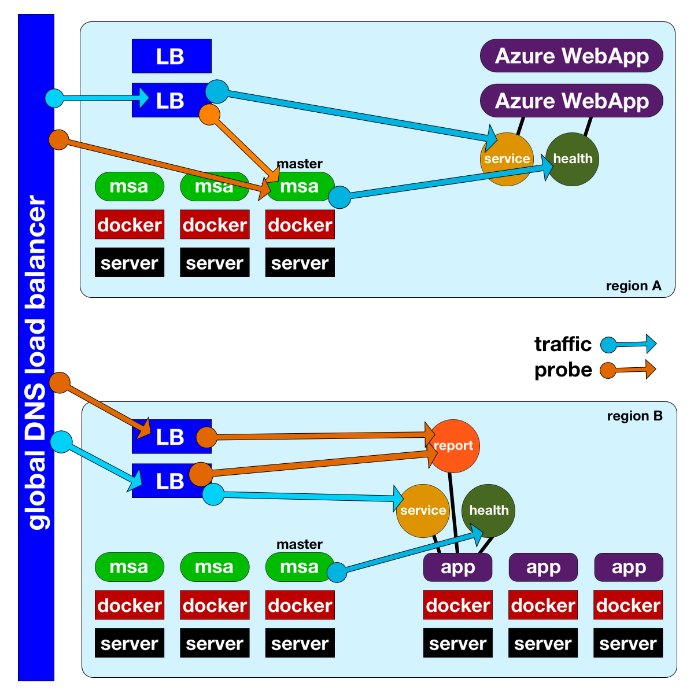

# Architecture

The general concept is that this tool understands the health state of your application and then reports that state to your load balancers.

There are a few different deployment options shown in the diagram above.

## Multi-region

While MSA does not have to be used in a multi-region deployment, it was my expectation that most implementations would feature at least 2 regions. You will typically route between regions using a Global DNS Load Balancing service (like Azure Traffic Manager or F5 BIG-IP DNS). A solution like this will typically probe an endpoint 

...

## Relative endpoints

It would be great if all load balancers supported probing any FQDN instead of a relative path because then you could use the easier probe pattern shown in "region A". Unfortunately, most cannot so the probe for the load balancer must point to a 

Run both the MSA services and the application services in a fabric that supports some method of redirection

Use a service that will map the requests to the proper place  - layer 7 lb like NGINX

Use a report service

## MSA in Docker

talk about Swarm
talk about hosting on other things (App Service)

## Other architectures

There are an infinite number of architectures that could have been shown. As long as there is some endpoint that can be probed by MSA 

SHOW THE USE OF A DISCOVERY SERVICE